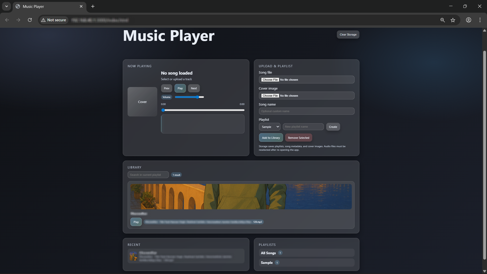
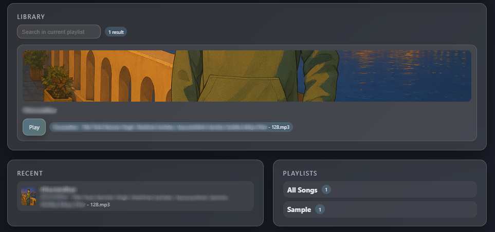
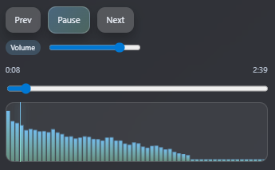

# Music Player

A glassmorphism-themed, in-browser music player that lets users upload their own audio files and cover art, organize songs into playlists, and play them with modern controls, a waveform, and a draggable playhead. Audio files are persisted in IndexedDB so they can still play after page reloads, while metadata is saved in localStorage.

## Preview

> App Overview

> Library & Playlists

> Waveform + Playhead

<video src="assets/screenrecord-waveform.mov" autoplay loop muted playsinline width="100%">
Waveform Preview
</video>

## Features

- Upload audio files and cover images
- Play/Pause, Next, Previous, Volume control
- Progress bar with scrubber
- Animated waveform visualization
- Draggable playhead with hover time tooltip
- Create playlists and add songs to playlists
- Remove songs from the library
- Recent tracks list
- Search/filter within the current playlist
- Persistent storage
  - Metadata, playlists, and recents in `localStorage`
  - Audio blobs stored in `IndexedDB`

## How It Works

- `index.html` provides the UI structure.
- `styles.css` defines the glassmorphism theme, layout, and animations.
- `app.js` handles playback, uploads, playlist management, search, waveform rendering, and storage.

## Usage

1. Open `index.html` in a modern browser (Chrome, Edge, or Firefox recommended).
2. Use **Song file** to upload an audio file and **Cover image** to upload artwork or any image of your choice.
3. (Optional) Enter a custom song name.
4. Select a playlist from the dropdown or create a new one.
5. Click **Add to Library** to save it.
6. Click **Play** on any song card to start playback.
7. Use the transport controls, progress bar, or waveform playhead to seek.

## Storage Behavior

- Playlists, recent history, and song metadata persist across reloads.
- Audio files are saved in IndexedDB, so songs remain playable after reloads.
- If IndexedDB is blocked or unavailable, audio files will not persist, but metadata will still be saved.

## Project Files

- `index.html` - UI markup
- `styles.css` - glassmorphism styling + animations
- `app.js` - player logic, waveform, search, and storage

## Notes

- Some browsers may require user interaction before audio playback can start.
- Large audio libraries may take a moment to rehydrate from IndexedDB on load.

## License

MIT Licence
This project is provided as-is for personal and educational use.
